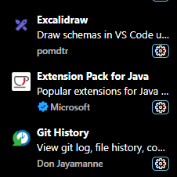
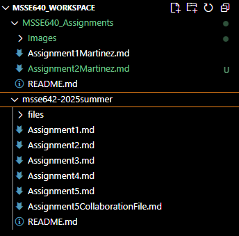
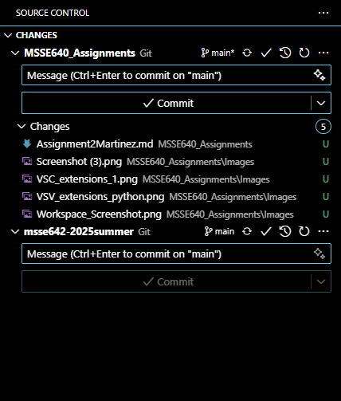

# WEEK 2 ASSIGNMENT

## ACTIVITY 1: Configure Visual Studio Code (VSC)

- In the mark down file for this weeks assignment, include a screenshot of VSC running on your local machine:

.png)

- Install the following extensions in VSC
    i. Excalidraw\
   ii. Git History\
  iii. Python\

## ACTIVITY 2: Clone the class repo and add to your VSC Workspace

- Ensure that your student repo and the class repo folders are open in VSC. Save as a VSC workspace
- Include a screen shot showing both repos as part of the workspace

## ACTIVITY 3: Writing a good readme file

A good README document for software includes the following:
* __Description of the software__
  * A good description of the software allows users that have shared access to your repository understand the big picture about what your software is, how it is meant to behave, its purpose, etc...
* __Instructions__
  * In order for users to use your software, they need proper instructions on how to install, execute, and operate the software. This is also important for testing your software with other collaborators.
* __Usage Examples__
  * Usage examples are great for users who have trouble understanding how to use your software.
* __Contribution Guidelines__
  * Contribution guidelines help collaborators contribute to the project in an organized and responsible manner. Every project requires a sense of structure so that every change doesn't create problems for the project as a whole but instead creates clear instructions for collaborators on how the project should be built.