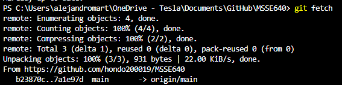
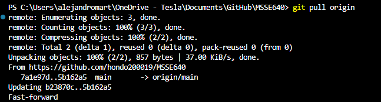

# WEEK 4 ASSIGNMENT

## Configuration
1. What are the commands to configure your user.name and your user.email. Should this be configured globally or in your repo. Why or why not?
```
    git config --local user.email "amartinez087@regis.edu"
    git config --local user.name "Alejandro Martinez"
```
    The ```--global``` flag configures the email and user name globally, meaning these values will be used across multiple repositories on your system. It's ideal if you're using the same identity across all of your Git repositories, and it only needs to be configured once. However, if you have different identities across your different repositories (e.g. work, personal, school repos) then configuring locally is the way to go using the ```--local``` flag.

2. How do you configure the core editor for git?
```
    git config --global core.editor "notepad"
```
    This command configures notepad as the core editor for git.

3. How do you view your global config and your local (for the repo) config.
```
    git config --list --local
    git config --list --global
```

## Working With a Local Repo
4. What are the steps to create a new local repo via the CLI?
```
    echo "# MSSE640-2025summer" >> README.md
    git init
    git add README.md

    git config --local user.email "rgranier@regis.edu"
    git config --local user.name "Randall Granier"


    git commit -m "first commit"
    git branch -M main
    git remote add origin https://github.com/hondo200019/MSSE640.git
    git push -u origin main
```

5. How do you clone a repo and what's the difference between cloning and creating a new repo from scratch? Practice cloning a public repo from somewhere.
    Cloning a repo:
    ```
        git clone https://github.com/hondo200019/MSSE640.git
    ```
    Cloning a repo essentially copies all of the project files onto your local workspace and configures your git workspace at the same time, where as creating a new repo from scratch forces you to configure your local repository for git.

6. How do you look at the status of your repo? What information does this give you?
```
    git status
```
This command tells you what branch you're currently working on, what changes have yet to be staged for commit, and what files are untracked. Here's an example output using my class repo:
```
    On branch main
    Your branch is up to date with 'origin/main'.

    Untracked files:
    (use "git add <file>..." to include in what will be committed)
            Assignment3Martinez.md

    nothing added to commit but untracked files present (use "git add" to track)
```

7. How do you stage changes to your local repo in prepartion for a commit?
```
    git add <file>
```

8. How do you commit changes to your local repo?
```
    git commit -m <commit message>
```

9. Include an example of a file that will allow you to "ignore" files in your repo. What kinds of files should not be part of your version control?
    .gitignore files tell git what files or folders should be ignored from staging and committing. Some files that can be excluded from your version control are log files, OS files, environment files (.env), etc...

10. When files are under version control, you can't delete them using the OS commands. How do you delete files using git?
```
    git rm <file>
    git commit -m "Removed file"
```

## Working With a Remote
11. How do you view the remote repo that is associated with your local repo?
```
    git remote -v
```
    Output:
    ```
        origin  https://github.com/hondo200019/MSSE640.git (fetch)
        origin  https://github.com/hondo200019/MSSE640.git (push) 
    ```

12. What is the function of the ```git fetch``` command?
    ```git fetch``` downloads changes from a remote repository into your local repository without merging or modifying your working files.

13. What is the difference between fetch and pull? Practice using both and show the results.
    Fetch downloads changes without merging changes into your working directory, whereas pull downloads AND merges changes to your current branch immediately.
    
    

14. Make some changes in your repo and using the command line to sync those changes with your remote repo. Show the results.
    I made changes to this markdown file and am currently syncing these changes to my remote repo using CLI.