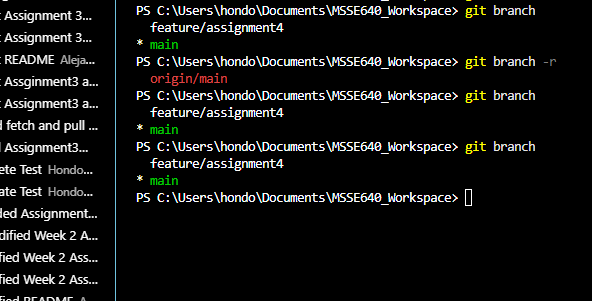

# WEEK 5 ASSIGNMENT

## Activity 1
* You will see the branch at the bottom of the window, but you can also use the CLI, to see the local and remote branches. Is there a remote branch created yet?\

\

At this point I've only created a branch in my local repository. I have to publish the new branch to the remote repository to really create that remote branch.

* What is different when you run git branch and git branch -r?\
git branch shows only your local branches whereas git branch -r shows only remote-tracking branches.

* When you are done making your changes, go to Git Hub (the URL), and issue a pull request to merge your feature branch on the remote repo. This will also delete your remote feature branch. Will the local feature branch still exist?\

The local feature branch will still exist until I either delete it or merge it with my main local branch.

